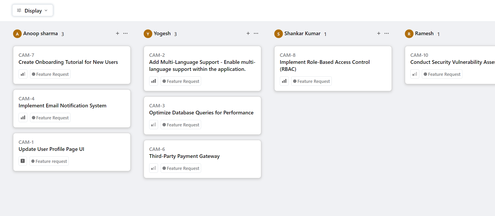

# Kanban Board Application

This **Kanban board application** is built using **React JS** and leverages the API provided by [QuickSell](https://api.quicksell.co/v1/internal/frontend-assignment) to dynamically manage and organize tasks. The application enables users to efficiently handle tasks by grouping and sorting them based on their preferences, offering flexibility and control over their workflow. 

It also preserves the user's customized view even after a page reload, ensuring continuity in task management.

## Key Features

- **Dynamic Grouping**: Organize tickets by **Status**, **User**, or **Priority** for better visualization and task management.
- **Advanced Sorting**: Sort tickets by **Priority** or **Title**, helping users prioritize tasks effectively.
- **Persistent View State**: Grouping and sorting options are saved in local storage, retaining user preferences even after reloading the page.
- **Priority Levels**: Tasks are assigned a priority value, helping users focus on what matters most:
  - **Urgent** (4)
  - **High** (3)
  - **Medium** (2)
  - **Low** (1)
  - **No Priority** (0)
- **Responsive UI**: The interface is optimized for various screen sizes, ensuring seamless user experiences across devices.

## Screenshots

  
*Screenshot of the application's user interface*  

## Live Demo

Check out the live version of the Kanban board application [here](https://kanban-board-one-silk.vercel.app/).

## Getting Started

To run the Kanban board application locally, follow these steps:

### Prerequisites
- Ensure **Node.js** and **npm** are installed on your machine.

### Installation Steps

1. **Clone the Repository**:
    ```bash
    git clone https://github.com/Shashikr36/Kanban_Board.git
    ```

2. **Navigate to the Project Directory**:
    ```bash
    cd kanban-board
    ```

3. **Install Dependencies**:
    ```bash
    npm install
    ```

4. **Start the Development Server**:
    ```bash
    npm start
    ```

5. **Access the Application**:  
   Open your web browser and go to `http://localhost:3000` to interact with the application.

## Usage Instructions

1. **Display Tickets**: Click the "Display" button to fetch and show tickets from the API.
2. **Group Tickets**: Select grouping options such as Status, User, or Priority to organize tasks.
3. **Sort Tickets**: Arrange tasks by Priority or Title to enhance task management.
4. **Persistent Preferences**: Preferences are automatically saved in local storage, so your selected settings are preserved after page reloads.

## Contribution Guidelines

Contributions to improve this project are welcome! Here’s how you can contribute:

1. **Fork the Repository**: Create a copy of the repository on your GitHub account.
2. **Create a Branch**: Create a new branch for your feature or bug fix.
    ```bash
    git checkout -b feature/your-feature-name
    ```
3. **Make Changes**: Implement your feature or fix.
4. **Push Your Changes**:
    ```bash
    git push origin feature/your-feature-name
    ```
5. **Submit a Pull Request**: Once your changes are finalized, submit a pull request. Please provide detailed explanations of your updates.

## Contact Information

For any questions, suggestions, or feedback, feel free to reach out to the project maintainer:

- **Name**: Shashi Kumar
- **Email**: [shashi.kumar.min21@itbhu.ac.in](mailto:shashi.kumar.min21@itbhu.ac.in)
